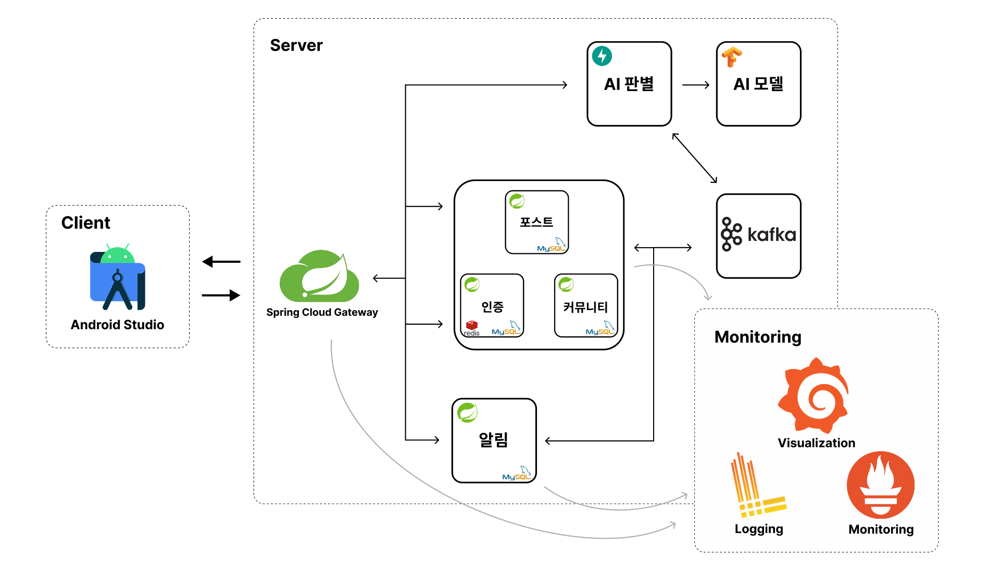

# Phishing Block Server

----

## 🌒 프로젝트 소개
Phishing Block은 사용자의 전화를 실시간으로 감지하고 AI를 활용하여 통화 내용을 분석해 보이스피싱 여부를 분석합니다. 
보이스피싱으로 의심되는 경우 사용자에게 즉시 경고를 제공하며, 등록된 그룹원들에게도 알림을 전송하여 피해를 예방할 수 있도록 돕습니다.
## Tech Stack
***Server***

  
 

***Database***

  
 

***AI***

  
 

***Event Broker***

***Monitoring***

 

## ⚙Architecture

## 🔑 서비스 주요 기능
### 1. 보이스피싱 여부 분석
> AI를 활용하여 실시간으로 통화 내용을 분석하고 보이스피싱 가능성을 평가합니다.
### 2. 보이스피싱 감지 시 그룹 알림
> 보이스피싱이 감지될 경우 사용자에게 즉시 경고를 제공하며, 등록된 그룹원들에게도 알림을 전송합니다.
### 3. 피싱 의심 계좌·전화번호·이메일 조회
> 사용자들은 보이스피싱이 의심되는 계좌, 전화번호, 이메일을 조회하여 사기 여부를 확인할 수 있습니다.

## 👏 팀원 소개

<table>
    <tr align="center">
        <td width="33%"><B>염중화(Android)</B></td>
        <td width="33%"><B>윤태경(Android)</B></td>
        <td width="33%"><B>신승용(Server)</B></td>
    </tr>
    <tr align="center">
        <td>
            

        </td>
        <td>
            

        </td>
        <td>
            

        </td>
    </tr>
    <tr align="center">
        <td>
            <a href="https://github.com/junghwa1"><I>junghwa1</I></a>
        </td>
        <td>
            <a href="https://github.com/taegung"><I>taegung</I></a>
        </td>
        <td>
            <a href="https://github.com/sso9594"><I>sso9594</I></a>
        </td>
    </tr>
    <tr align="center">
        <td>
            AI 모델 개발, AOS 개발
        </td>
        <td>
            포스트 서버, 커뮤니티 서버 개발
        </td>
        <td>
            Spring Cloud Gateway, 인증 서버, 
             
            알림 서버, AI 판별 서버,
             
            Kafka 구축, 모니터링 인프라 구축, 배포
        </td>
    </tr>
</table>
